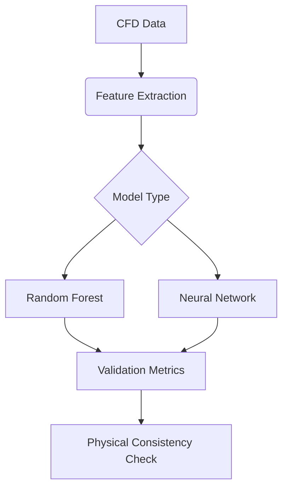

# 🧑🔬 Hi there! I'm Felix von Bingen 

<a href="https://github.com/lucky-c0der">
  
</a><br>

🌍 **Base of Operations** in Ann Arbor, MI, USA _(Recently)_  
🎓 **PhD Candidate** in Power Engineering & Engineering Thermophysics  
🔭 **Research Focus** on Multiphase flow modeling with ML augmentation  
⚡ **Coding Mantra**: _"From Navier-Stokes to Null Safety"_

## 🛠️ Technical Arsenal

**Core Competencies**  


**Emerging Expertise**  


**Scientific Toolbox**  


## 🔭 Current Explorations

### **Rust in Scientific Computing**
```rust
// Conjugate heat transfer simulation kernel
fn solve_energy_eq(
    temp_field: &mut Array2<f64>,
    flux: Array2<f64>,
    dt: f64
) -> Result<(), SolverError> {
    let alpha = 0.15; // Thermal diffusivity
    temp_field.zip_mut_with(&flux, |t, &f| {
        *t += alpha * f * dt
    });
    Ok(())
}
```

### **Mermaid Code for ML-Enhanced Thermodynamics**


## 🎯 Research Philosophy

> "Every line of code should obey the laws of thermodynamics"  
> _- The Three Principles of Computational Physics:_  
> 1. **Conservation of Computational Energy**  
>    (Optimize resource usage)  
> 2. **Entropy of Code Complexity**  
>    (Manage technical debt)  
> 3. **Heat Death of Legacy Systems**  
>    (Embrace modern toolchains)

## 🧪 Experimental Zone

**Ask me about:**  
- The Prandtl number of my morning coffee ☕  
- How blues scales relate to debug rhythms 🎸  
- Why Rust lifetimes > Boltzmann constant  

**Lab Gadgets:**  
```python
class CoffeeBrewer:
    def __init__(self, temp=92.5):
        self.temp = temp  # Optimal extraction temperature
        
    def brew(self, grind_size):
        return self._solve_navier_stokes(grind_size)
```
**Let's discuss:**  
- High-performance computing in thermofluids  
- Rust for scientific computing ecosystems  
- Open source research software development

--- 

⭐ _Where Differential Equations Meet Elegant Code_  
🔭 _Bridging Thermal Physics and Modern Software Engineering_
